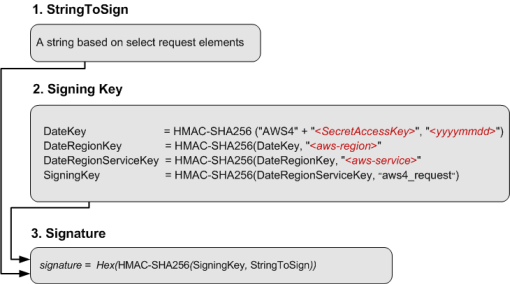

# Rust implementation of the AWS SigV4 signing process

Signature Version 4 (SigV4) is the process to add authentication information to AWS API requests sent by HTTP. For security, most requests to AWS must be signed with an access key. The access key consists of an access key ID and secret access key, which are commonly referred to as your security credentials. For details on how to obtain credentials for your account, see [Understanding and getting your AWS credentials](https://docs.aws.amazon.com/general/latest/gr/aws-sec-cred-types.html).

### How Signature Version 4 works

1. Create a canonical request.
2. Use the canonical request and additional metadata to create a string for signing.
3. Derive a signing key from your AWS secret access key. Then use the signing key, and the string from the previous step, to create a signature.
4. Add the resulting signature to the HTTP request in a header or as a query string parameter.

## Resources

* [Python Example](https://docs.aws.amazon.com/general/latest/gr/sigv4-signed-request-examples.html)
* [Rusoto signature](https://github.com/rusoto/rusoto/tree/master/rusoto/signature)